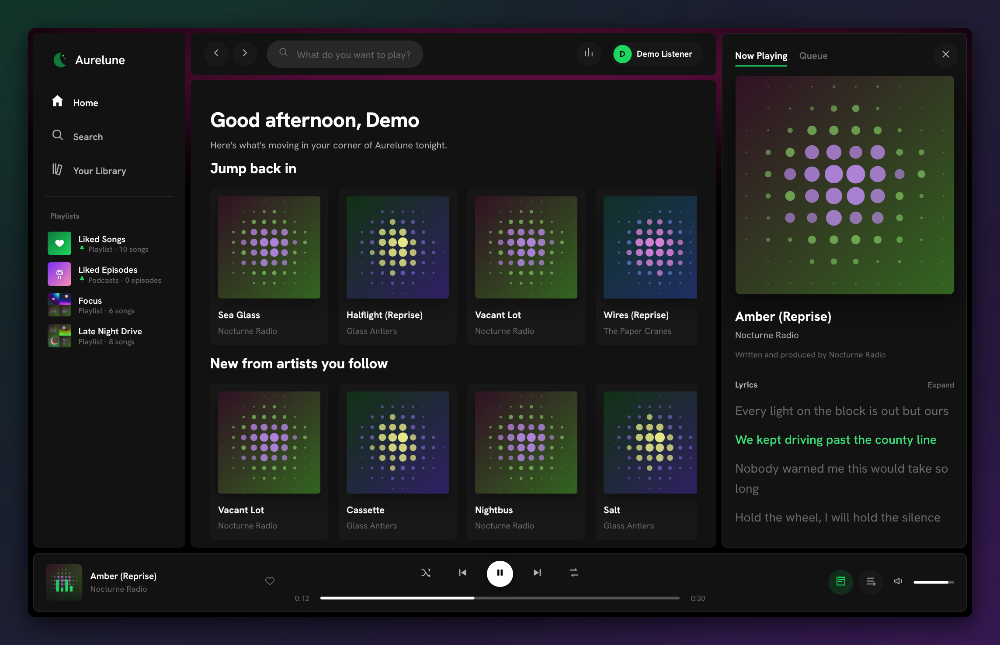
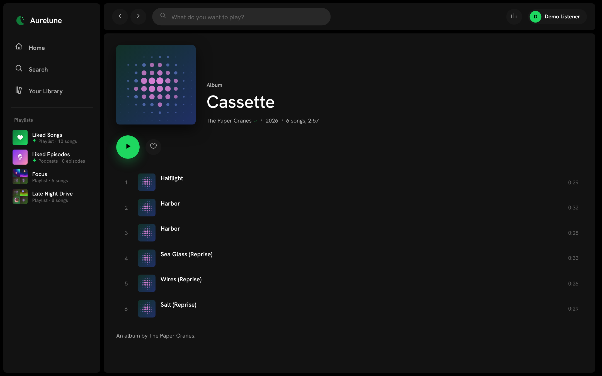
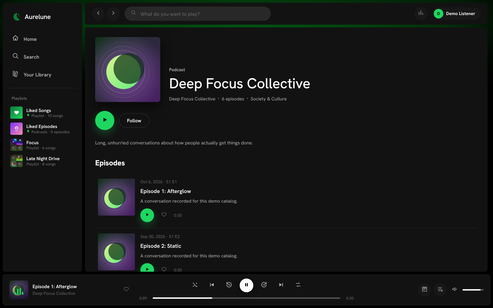
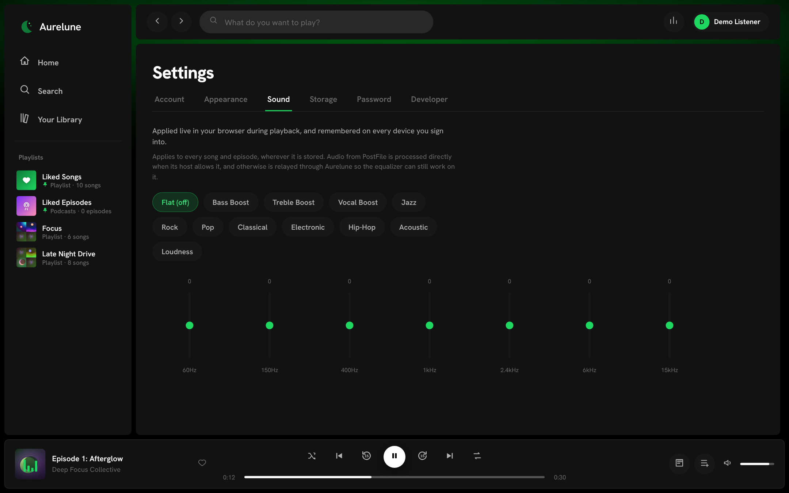
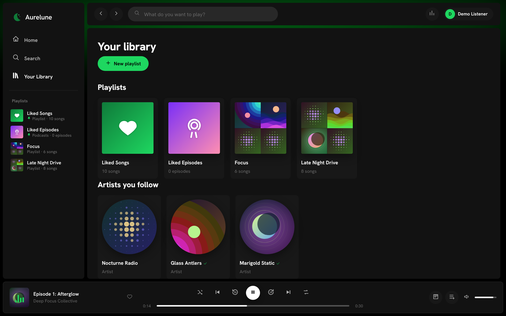
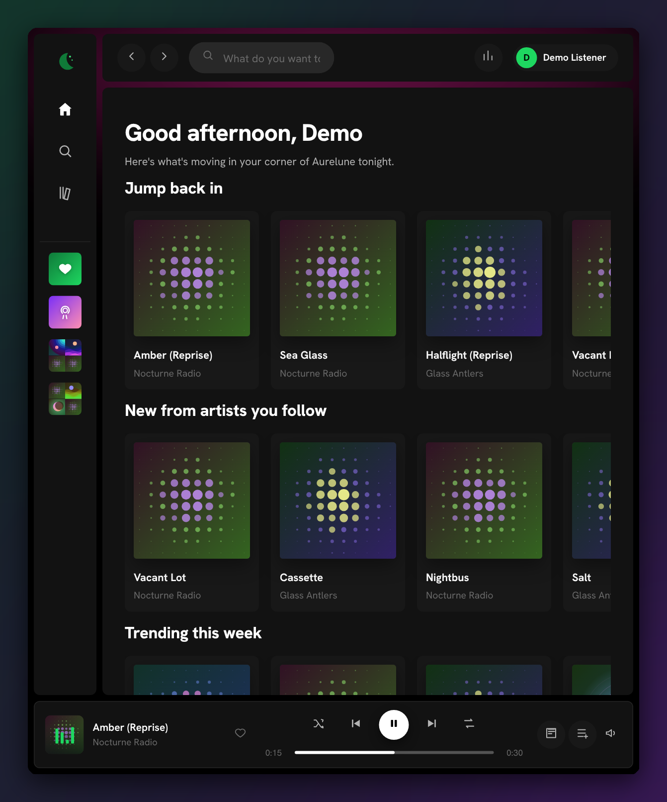
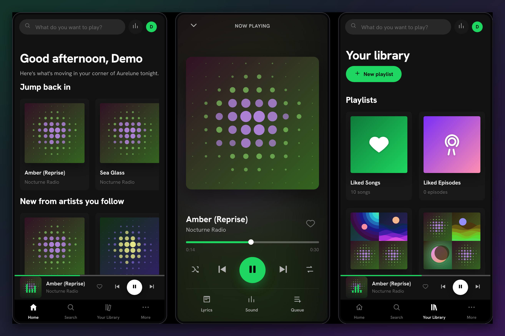

# Aurelune

A self-hosted, Spotify-class streaming platform for music and podcasts —
built on Node.js, Express, and MongoDB. Artists apply for a creator page,
upload tracks and albums with synced (LRC) lyrics, podcasters publish shows
and episodes, listeners get playlists, likes, follows, and a full listening
history with stats — and everything is also available over a documented,
token-authenticated **web API**, so you (or anyone) can build a bot, a
widget, or a companion app on top of your own data.

The same client runs three ways from one codebase, the way Discord's does:
a **web app**, a **desktop app** (Electron, wraps the web app in a native
window and manages the server for you), and a **mobile shell** (Capacitor,
points a native wrapper at your deployed server).

## Preview

<p align="center">
  
</p>

<table>
  <tr>
    <td width="50%"><br><sub><b>Albums & artists</b> — generative cover art for everything that has none.</sub></td>
    <td width="50%"><br><sub><b>Podcasts</b> — shuffle, repeat and ±15 s skip in the player bar.</sub></td>
  </tr>
  <tr>
    <td width="50%"><br><sub><b>Equalizer</b> — 7 bands and presets, applied to every song and episode.</sub></td>
    <td width="50%"><br><sub><b>Library</b> — playlists, Liked Songs and Liked Episodes, followed artists and podcasts.</sub></td>
  </tr>
</table>

**Tablets and phones** get their own layouts: a roomy player bar on tablets, and on phones a mini player that opens a full-screen player (swipe down to close).

<p align="center">
  
  &nbsp;
  
</p>

<sub>Screenshots are generated from the demo catalog with `python3 scripts/screenshots.py` (see the header of that file), so they are easy to refresh after a UI change.</sub>

## Why "Aurelune"

Aurora + lune (moon). The whole visual identity — the generated cover art,
the color palette — leans into that: every track, album, and show that
doesn't have uploaded artwork gets a unique, deterministic generative
cover (a moon-and-aurora motif) rendered as SVG, so nothing ever looks
blank. It isn't the name of any existing music company or product.

## Features

- **Accounts & creator pages** — anyone can sign up; anyone can apply to
  become a creator (artist or podcaster). Admins approve, reject, verify,
  or suspend creator pages from a built-in admin panel.
- **Offline downloads** — a download button next to the heart; songs and episodes are kept encrypted on the device, play only inside
  Aurelune, need a check-in every 30 days, and creators can switch them off per item (see *Offline downloads*).
- **Music** — albums/EPs/singles, per-track credits, genre, explicit flag,
  and **lyrics** with automatic LRC (`[mm:ss.xx]`) sync detection — paste
  timestamped lyrics and they'll scroll in time with playback, or paste
  plain lyrics and they'll show as a static sheet.
- **Podcasts** — shows with seasons/episodes, transcripts, and per-listener
  resume position.
- **Listening** — likes, follows (artists & shows), saved albums,
  playlists (drag-free reordering via the API, public/private sharing),
  queue, shuffle/repeat, Media Session integration (OS-level play/pause/
  next on your keyboard, lock screen, or car display).
- **"Grab my listening"** — a full history/stats page (minutes per day,
  time-of-day heatmap, top tracks/artists/genres, streaks), a one-click
  CSV export, and a full JSON data export.
- **A real web API** — every one of the above is exposed at `/api/v1` with
  scoped personal access tokens (create them under Settings → Developer),
  so a third-party integration only ever gets the access it asked for.
  Read the live reference in-app at **Settings → Developer → API
  reference**, or hit `GET /api/v1/docs`.
- **Now-playing, live** — `GET /api/v1/me/player` and a Server-Sent-Events
  stream at `/api/v1/me/player/stream` expose what you're playing right
  now, in real time, to anything you build (a Discord bot, a status
  overlay, a smart-home display).
- **Full-page lyrics** — an immersive, auto-scrolling lyrics view for any
  track with synced (LRC) lyrics: the current line highlights and the page
  scrolls itself as the song plays. Scroll away to read ahead and a "Sync"
  button appears to jump back in; click any line to seek playback to that
  moment.
- **Personal equalizer** — 11 presets (Bass Boost, Jazz, Rock, Vocal Boost…)
  plus a 7-band custom graphic EQ under Settings → Sound. It's applied live
  in the browser via Web Audio filters and remembered on your account, so
  it follows you to any device you sign into.
- **Right-click menus** that do real things — Play next, Add to queue, Add
  to playlist, Share a link, Share an embeddable player, Exclude a track
  from your recommendations, or Report it (visible to admins under
  Admin → Reports).
- **Ambient now-playing glow** — a soft color wash behind the interface
  that shifts with whatever's currently playing.
- **A sidebar that behaves like a real app** — collapsible to icons-only,
  freely resizable by dragging its edge, both remembered per browser.
- **Encrypted at rest** — every uploaded audio file is AES-256 encrypted on
  disk and decrypted on the fly per authenticated request; streaming
  requires a signed-in account. See "A note on file protection" below for
  what this does and doesn't guarantee.

## Requirements

- Node.js 18.17+
- MongoDB 6+ reachable at the URI you configure (a local `mongod`, a
  Docker container, or a hosted cluster like Atlas all work identically —
  Aurelune talks to it purely through Mongoose)

## Quick start

```bash
npm install
cp .env.example .env      # edit if you need to (a local Mongo needs no changes)
npm start
```

Open **http://localhost:3000**. On first run, if the database is empty,
Aurelune:

1. Creates an **admin account** — email/password printed to the console
   (or set `ADMIN_EMAIL`/`ADMIN_PASSWORD` in `.env` beforehand).
   **Change this password immediately** via Settings → Password.
2. Seeds a demo catalog — a handful of artists and a podcast, with real,
   playable audio. That audio is **not music** — it's generated on the
   fly by a tiny offline synthesizer (`server/synth.js`) so the app isn't
   blank on first launch, with zero copyright concerns. Log in as
   **demo / demo12345** to see a populated library, listening history,
   and stats immediately. Set `SEED_DEMO=false` to skip this.

To re-run the seeder manually against an existing database:
`npm run seed` (adds to what's there; safe to run once).

## Publishing real content

1. Sign up (or use an existing account) → the nav has a **For Creators**
   link → request a creator page (pick "music", "podcasts", or "both").
2. Sign in as the admin account → **Admin → Creator requests** → approve it.
3. Back in that account, **For Creators** now opens the **Studio**:
   upload tracks (drag in an MP3/M4A/FLAC/WAV/OGG file — title, genre, and
   embedded cover art are read automatically from the file's tags if you
   don't fill them in), group them into albums, or set up a podcast and
   add episodes.

Uploaded files are stored under `DATA_DIR/uploads` (`./data/uploads` by
default) — back that directory up along with your MongoDB data.

## A note on file protection

Every uploaded audio file is AES-256-CTR encrypted the moment it's saved —
what sits in `DATA_DIR/uploads/audio` is ciphertext, not a playable file.
Streaming decrypts on the fly, per request, only for a signed-in account
(anonymous requests get a 401, including for otherwise-public tracks).
This is real protection against the actual likely risk for a self-hosted
service: someone getting at your disk, a backup, or an old drive and
finding a folder of ready-to-play files.

It is **not** the same thing as licensed DRM (Widevine/FairPlay/PlayReady).
Those systems also stop an *authorized* listener's own device from ever
touching decoded audio, which needs a paid vendor license, a license
server, and hardware-backed key handling — not something any self-hosted
project builds from scratch. If your own browser can play a sound, your
own machine can, in principle, capture what it's playing; no software
fully closes that door, including Spotify's (stream-ripping tools exist
despite it). What's implemented here is the strongest realistic version of
"don't just leave raw files lying around," not a copy-protection system.

## Offline downloads

Next to the heart (player bar, full-screen player, song and episode rows, the right-click menu) there is a **download** button, like Spotify's.
A downloaded song or podcast episode is stored **encrypted on the device** and plays **only inside Aurelune**, with no connection.

- **Where it lives.** The app's own storage (IndexedDB), the same on the web, the desktop app and the phone app. Nothing is written as a
  file you could open or copy: what is stored is ciphertext.
- **How it is protected.** The server gives a signed-in listener a *licence*: a key derived for that account **and** that device
  (`POST /api/v1/downloads/license`). The browser imports it as a non-extractable WebCrypto key. The audio is cut into 1 MB pieces, each
  AES-256-GCM encrypted (fresh IV per piece; the item and piece number are authenticated, so pieces can't be swapped). Playing decrypts in
  memory and hands the player a blob.
- **30 days offline.** A licence lasts 30 days. Opening Aurelune online renews it (about once a day), so normal use never notices. If the
  device stays offline for more than 30 days the key is deleted: the downloads stay on disk but can't be opened until it is online again.
- **Revocation.** Signing out removes every download and the key. A session that the server no longer accepts does the same. Changing the
  account password rotates the key, so copies on other devices are dropped at their next check-in; *Settings → Storage → Revoke* does that on demand.
- **Limits.** Songs and episodes, up to 200 MB each and 2 GB in total per device (also bounded by what the browser allows). Visible and
  clearable under **Downloads** (sidebar / profile menu) and *Settings → Storage → Offline downloads*.
- **Who can download.** Any signed-in listener, for anything they could stream (private items follow the usual visibility rules). A creator can
  switch it off per track (*Allow downloads* in the track form) or per episode (*Downloads* column in the Studio podcasts tab, and in the new-episode form).
  A switched-off item has no download button, and `GET /stream/...?dl=1` answers `403 downloads_disabled`.
- **Opening the app offline.** A small service worker (`public/sw.js`) keeps the app shell and the pictures you've seen, so Aurelune starts
  without a connection (it needs https or localhost). It then shows an *Offline* marker and the Downloads page; pages that need the server send you there.
- **Configuration.** `DOWNLOAD_LICENSE_SECRET` (optional) pins the secret the licence keys are derived from. If it is missing, `AUDIO_ENCRYPTION_KEY`
  is used, and on Vercel a stable secret is derived from your settings. Self-hosted with none of these, the secret lasts until the server restarts,
  after which devices renew their licence and download again.

**What this is, and isn't.** It keeps downloads Aurelune-only and stops casual copying: there is no playable file, the key is bound to the
account and the device, and it expires. It is **not** DRM (see *A note on file protection*): someone who can run the app and hear a song can, in
principle, capture what their own speakers play, exactly as with any streaming service. `test/integration/downloads.py` checks all of the above
in a real browser: stored bytes aren't audio, offline playback and seeking, offline app start, licence expiry and renewal, password-change
revocation, sign-out wipe, and the creator's switch.

## Configuration

Every setting lives in `.env` locally, or in the Environment Variables
screen on Vercel (see `.env.example` for the full annotated list):
`MONGODB_URI`, `PORT`, `ADMIN_EMAIL`, `ADMIN_PASSWORD`, `POSTFILE_API_KEY` / `POSTFILE_API_KEYS`,
`STORAGE_DRIVER`, `POSTFILE_MAX_MB`, `POSTFILE_PART_MB`, `STREAM_PROXY`, `POSTFILE_API_BASE`, `AUDIO_ENCRYPTION_KEY`, `DOWNLOAD_LICENSE_SECRET`, `DATA_DIR`,
`MAX_AUDIO_MB` (default 600), `MAX_IMAGE_MB`, `SEED_DEMO`, `NODE_ENV`.

## Playlist pictures

A playlist's picture is built from its most recently added songs, as on Spotify: four different covers
make a 2x2 collage of the last four added; one to three covers show the latest song's cover on its own
(ten songs from one album never tile the same image four times); an empty playlist gets generated art
that is unique to it. It updates as songs are added or removed and appears in the sidebar, the library,
the playlist page, search and the "Add to playlist" picker.

## Sidebar

The sidebar holds Home, Search, Your Library, then Liked Songs, Liked Episodes and your playlists (it scrolls
and ends above the player bar, which sits in its own row at the bottom and only takes space once something is playing). **For Creators** and **Admin** live in the profile menu (top right, or
"More" on phones).

## Pinned playlists and Liked Songs

The sidebar starts with **Liked Songs**, followed by your playlists. Pin a playlist with the pin button
that appears on hover, the right-click menu, or the pin button on the playlist page; pinned playlists
stay at the top (most recently pinned first), also in the Library. Liked Songs has an icon and colour you
can change: click its cover on the Liked Songs page, or right-click it in the sidebar. **Liked Episodes**
works the same way (click its cover, or right-click it and choose *Change icon…*). Each keeps its own
choice; by default Liked Songs is a green heart and Liked Episodes a violet podcast tile. They are
shown as pictures only when the sidebar is collapsed. API: `PUT/DELETE /playlists/:id/pin`;
`PATCH /me {liked_icon, liked_color}` and `PATCH /me {liked_episodes_icon, liked_episodes_color}`
(icons: heart, star, bolt, flame, moon, note, podcast, mic; colours: green, purple, pink, blue, orange, gray, violet).

## Liked Songs vs. Liked Episodes

Songs and podcast episodes are liked separately. The heart on a song goes to **Liked Songs**; the heart on a
podcast episode (on its row, in the player bar, or in its right-click menu) goes to **Liked Episodes**, a
second default entry in the sidebar and library (with its own icon and colour, see above). API: songs `PUT/DELETE /me/likes/:trackId`, episodes
`PUT/DELETE /me/likes/episodes/:episodeId`, list with `GET /me/likes/episodes`.

## Private tracks and episodes

When uploading (or any time later, from **Studio → Tracks / Episodes**) a creator can make an item **private**:
turn off the **Public** switch, or click the Public/Private pill in the table. A private item is
visible, searchable and playable only to the account that owns the creator page (across all of that
account's pages). Everyone else, signed in or not, gets a 404 from every endpoint and never sees it in
search, genres, artist/album/show pages, the "now playing" API, embeds, or other people's playlists.
The owner sees it with a small lock, in an **Only you can see these** shelf on Home and in their own
search. Flip it back to Public at any time. Through the API: `visibility: "private" | "public"` on
`POST/PATCH /studio/tracks` and `/studio/episodes` (`published: false` still works).

## Private podcasts, and empty podcasts

A podcast (show) follows the same rules. **Studio → Podcasts → New podcast / Edit** has a **Public** switch (and a
Public/Private pill on each row). A private podcast, **with all its episodes**, is visible, searchable and playable only to
the account that owns the page and to admins; for everyone else every endpoint (the show page, its episodes' streams and
embeds, search, Home, the artist page, following it) answers 404. The owner sees a lock on it.

A **public podcast with no public episode yet is not advertised** either: it stays off other people's Home, search and artist
page until it has one (the owner and admins still see it, labelled "No episodes yet"; opening a direct link still works).
Through the API: `visibility: "private" | "public"` on `POST/PATCH /studio/shows`. Podcasts created before this existed have no
value stored and count as public.

## Private creator pages

A whole creator page can be private too: **Studio → Profile → Public page** switch (off = private).
A private page, and everything on it (tracks, albums, shows, episodes), is visible only to the
account that owns it and to admins. For everyone else it behaves as if it did not exist: it is missing
from search, Home, genres, "popular" lists, follows, other people's playlists/likes/history, the
public "now playing" API and embeds, and its artist/show/album pages, streams and covers return 404.
The owner sees a lock on the page switcher and a "Private page" note on the page itself. Anything
already following or liking the page's content simply stops seeing it; flipping the page back to
Public restores it all. Through the API: `visibility: "private" | "public"` (or `private: true`) on
`PATCH /studio/profile`.

## Lyrics timestamps (including hours)

Synced lyrics are LRC text. Accepted stamps, several per line allowed:

| Stamp | Meaning |
|---|---|
| `[MM:SS]`, `[MM:SS.xx]`, `[MM:SS:xx]` | minutes (can pass 59), seconds, fraction |
| `[HH:MM:SS.xx]`, `[HH:MM:SS:xx]` | **hours form** for anything past an hour, e.g. `[01:02:03.50]` |

`xx` is a fraction of a second, 1 to 3 digits (`5` = .5 s, `05` = .05 s). A bare `[A:B:C]` with nothing after the last number is read as
`MM:SS:xx` (the old behaviour) unless the same lyrics use the hours form elsewhere, in which case it is `HH:MM:SS`; use the
four-part `[HH:MM:SS:xx]` or `[HH:MM:SS.xx]` form to be unambiguous. The player clock also switches to `H:MM:SS` once an item passes
an hour. Clicking a line seeks to it and starts playback if paused, and the page follows the song again.
Songs with no lyrics say so immediately instead of loading forever.

## Collaborations

A song or episode can credit other creator pages: pick them in the **Collaborators** field of the upload/edit form (typeahead over existing
artists). Crediting one of **your own** other pages is instant. Crediting **someone else's** page sends an invitation: it appears under
**Studio → Collaborations** (with a count badge) for that page's owner, who can accept or decline. Until accepted the credit is visible only to
the two sides. Once accepted:

- the credit shows wherever the item shows (rows, cards, player bar, lock-screen metadata),
- the item is listed on the collaborator's artist page (episodes under *Featured on episodes*), counts in their track count, and is found
  when searching for them or by their followers' feed,
- if the item is private, accepted collaborators can still see and play it; nobody else can,
- a collaborator can leave at any time, and the uploader can remove anyone by editing the item.

Collaborators on a private creator page are never shown publicly. API: `collaborators` (JSON array or comma-separated page ids) on
`POST/PATCH /studio/tracks`, `/studio/shows/:id/episodes`, `PATCH /studio/episodes/:id`; `GET /studio/artists?q=`;
`GET /studio/collabs`; `POST /studio/collabs/:track|episode/:id/:accept|decline`. Tracks and episodes carry `collaborators: [{ id, name, slug, status }]`.

## Several creator pages per account

One account can run more than one creator page, for example a band, a solo
project and a podcast. Each page has its own name, bio, image, tracks, albums,
shows, followers and stats, and each is reviewed and approved on its own.

- **How many:** new accounts get `DEFAULT_CREATOR_PAGES` pages (default 1). An
  admin can change that for any user in **Admin, Users, Change**: a set
  number, unlimited, or back to the server default. Lowering a limit never
  deletes pages the person already has. It only stops new ones.
- **Rejected requests** don't use up a slot. A page that is still pending or
  was rejected can be withdrawn by its owner. A live page can only be removed
  by an admin.
- **In the Studio:** a row at the top switches between pages, with a "New
  page" button while there are free slots. The chosen page is remembered per
  browser and sent as the `X-Creator-Page` header, so it works on Vercel
  without any server-side state.
- **Upgrading:** older databases had a unique index that allowed only one
  page per account. Aurelune removes it automatically on startup.

## Drag & drop uploads

The drop areas in the Studio (audio for tracks and episodes, cover art for albums/podcasts, the profile image) really accept dragged files
now: the area highlights ("Drop it here"), an audio area takes audio and a picture area takes images (anything else gets a message and
doesn't replace what you chose), and in an upload dialog you can drop **anywhere on the dialog**. Dropping an audio file anywhere on the
Studio **Tracks** tab opens the upload dialog with it already chosen. A file dropped on any other part of the app is ignored instead of the
browser opening it and leaving the page. (Before, the "or drag a file here" hint was only text.) Code: `wireDropzone` in `public/js/views.js`.

## Upload storage: local or PostFile

Artists choose where each upload goes. Both options coexist, so the same
codebase runs on your own machine and on Vercel.

| | **Local** | **PostFile** (postfile.net) |
|---|---|---|
| Where files live | `DATA_DIR` on the server's disk | PostFile's storage / CDN |
| Available on | self-hosted, Electron, any host with a persistent disk | everywhere, including Vercel |
| Protection | AES-256 encrypted at rest; streamed through the API only for signed-in users, with Range/seek support | **Not encrypted**; the API only hands the CDN link to signed-in users |
| Equalizer | yes | yes (see below) |
| Big files | up to `MAX_AUDIO_MB` | up to `MAX_AUDIO_MB`, split into parts automatically |
| Needs | nothing | `POSTFILE_API_KEY` (or several: `POSTFILE_API_KEYS`) |

If only one is available, the picker shows only that one. `STORAGE_DRIVER`
sets the default when both are.

### Several PostFile keys, automatic rotation

Set `POSTFILE_API_KEYS="key1,key2,key3"` (commas, spaces or new lines; `POSTFILE_API_KEY` still works and the two are merged).
Uploads take the keys in turn, so load and storage spread over every account. If a key is out of quota, rate-limited, rejected
or its host is having trouble, that key is set aside for a while (30 min for quota, 15 min for a rejected key, about a minute
for rate limits) and the upload moves on to the next one, without the uploader noticing. A short blip gets one quick retry on
the same key first. Each stored file remembers which account holds it (only a fingerprint of the key is kept), so deleting
a track removes it from the right one. If every key fails the uploader gets a normal error message. Keys are never sent to
the browser or logged.

### Big files: split into parts, played as one

PostFile caps one upload (50 MB on the free plan). A larger file is cut into parts of `POSTFILE_PART_MB` (default 40, kept
below the plan cap and rounded to whole 3 MB pieces), each part is uploaded as its own PostFile file, to the next key in
rotation, and the track is saved with its list of parts. A 220 MB podcast becomes 6 parts. Listeners never see this:
the stream endpoint stitches the parts back into **one seekable stream** (Range requests work across the seams; a part
that drops mid-way is resumed from the exact byte). If any part fails to upload, the parts already sent are removed.

- On a normal host the whole file reaches the server and is split there.
- On Vercel the browser sends pieces of about 3 MB, and as soon as a part's pieces are in it asks the server to hand that
  part to PostFile, in a request of its own. No request runs for long, so the 60 s function limit isn't a problem, and the
  browser measures the duration itself (tags and artwork are read from the first part). A part that PostFile can't take right
  now is retried without resending the pieces.
- The largest file is `MAX_AUDIO_MB` (default 600).
- Parts are named `name-part2of6.mp3`, so PostFile sees ordinary audio files.

Streaming a multi-part file goes through your server (that is what joins the parts), so it costs function time and bandwidth
there; single-part files are still a plain redirect to PostFile's CDN. On Vercel a listener's connection can outlast the
60 s limit; the player simply asks again from where it stopped, but this is the one path I could not try on a real Vercel
deployment, so check a long episode after deploying (and raise `maxDuration` if your plan allows).

### Equalizer on every song, wherever it is stored

A browser only lets the equalizer process audio that is same-origin or sent with CORS headers. So:

1. PostFile tracks first play straight from PostFile's CDN with CORS. If the CDN allows it, the equalizer works and your
   server isn't involved.
2. If the CDN refuses (the first load fails before any sound), the same track is played again through your server
   (`/stream/...?proxy=1`, with seeking), where the equalizer works. The browser remembers this for a day.
3. `STREAM_PROXY=always` skips step 1 and always relays PostFile audio through the server, if you'd rather not depend on it.

Multi-part files are always served by your server, so they always work with the equalizer.

### Pictures that fail to load

Every cover and avatar URL carries the generated artwork it can be replaced with (in the URL fragment, `#art=...`, which is
never sent anywhere). If a picture can't be fetched (host down, bad connection) the generated art is shown right away instead of
a broken icon, and the real picture is retried quietly: after 3 s, 8 s, 20 s, 1 min, 3 min, then every 5 min, and immediately when the
connection comes back or the tab is focused again. It swaps in by itself.

## Deploying to Vercel

1. **Database.** Create a MongoDB Atlas cluster. Under *Network Access*
   allow `0.0.0.0/0`, because Vercel's outbound IPs aren't fixed. Copy the
   connection string.
2. **Push** this folder to a Git repo and import it in Vercel. No build
   command or output directory is needed. `vercel.json` routes every
   request to `api/index.js`, which wraps the Express app. `public/` is
   bundled with the function.
3. **Environment variables** (Project, Settings, Environment Variables):
   - `MONGODB_URI`: your Atlas string (**required**)
   - `ADMIN_EMAIL` and `ADMIN_PASSWORD`: **required**. In production no
     default-password admin is created, and the first signup does not
     become admin.
   - `POSTFILE_API_KEY` (or `POSTFILE_API_KEYS` for several): needed for uploads, since Vercel has no
     persistent disk
   - optional: `POSTFILE_MAX_MB` (default 50), `SEED_DEMO=true` if you want
     sample content
4. Deploy, sign in as the admin, and approve creators from the admin page.

**Limits that matter on Vercel**

- **4.5 MB request body cap.** A song won't fit in one request. PostFile
  doesn't allow uploads straight from a browser (it sends no CORS headers),
  so large files are sent in pieces of about 3 MB. The browser sends the
  pieces to Aurelune, which keeps them in MongoDB for a short time, joins
  them, reads the tags and duration, and uploads the result to PostFile.
  Leftover pieces from an abandoned upload expire after 2 hours. This
  needs free space in your Atlas database while an upload is in progress
  (up to the file size).
- **No local disk.** The filesystem is read-only except `/tmp`, which is
  wiped, so the Local option is hidden on Vercel.
- **Function duration.** `vercel.json` sets 60s. Big PostFile files go up one part per
  request (see above), so each request is short. Playing a multi-part file streams through
  a function; see the note above.
- **No long-lived connections.** The live "now playing" stream closes
  after about 9 seconds and the browser reconnects on its own. State is
  kept in MongoDB, not memory.
- **Bundle size** is 250 MB. `electron`, `electron-builder` and `jsdom`
  are dev-only, and `vercel.json` installs with `--omit=dev`.

Express's `PORT` only matters for local runs. Vercel ignores it, and
`server/index.js` (local) and `api/index.js` (Vercel) share the same
`server/app.js`. The Electron and Capacitor apps can point at your Vercel
URL, or run the local server.

## Tests

`npm test` runs the player logic test and the Studio upload UI test (jsdom)
in five hosting scenarios (self-hosted, Vercel with pieces, Vercel with parts, Vercel without pieces, no storage), with no database or network. `npm run mock:postfile`
starts a stand-in PostFile server on port 4010 (key `pf_mock_key`) so you can
try the PostFile path without an account: set `POSTFILE_API_KEY=pf_mock_key`
and `POSTFILE_API_BASE=http://localhost:4010`.

`player_ui.py` (animations switch, hover time box, seeking, Range edge cases, phone full-screen player) and `desktop_modes.py` (the real Electron app in every mode, including a locked client build) live there too.

`test/integration/` has end-to-end checks that need MongoDB and a running server (see its README): key rotation and failover against a
multi-key stand-in PostFile, big files split into parts and read back byte for byte (including ranges across the seams and the
Vercel-style part-by-part upload), and the collaboration flow.

**Verified on a real deployment:** creating an upload link works against the
live PostFile API, and PostFile does not allow browser-to-PostFile uploads
(CORS), which is why uploads go through Aurelune. **Not verified:** the actual
file upload from Aurelune to PostFile (only tested against a mock built from
its docs). Try one small and one large upload after deploying.

## Desktop app (Electron): two modes

The desktop app is built in one of two modes. Pick the one you want when you build:

| | **Client + Server together** (`full`) | **Client only** (`client`) |
|---|---|---|
| What's inside | The web client **and** the Aurelune server, started on the user's computer | Only the web client window: no server |
| Talks to | Its own local server (needs a MongoDB it can reach) | A **remote** Aurelune server you point it at |
| Installer size | Larger (the server and its dependencies, about 20 MB extra) | Tiny |
| Data lives | On that computer (app-data folder) | On the remote server |
| Build | `npm run desktop:build:full` | `npm run desktop:build:client` |

```bash
npm run desktop:build                       # asks: 1) Client + Server  2) Client only
npm run desktop:build:full                  # Client + Server together
npm run desktop:build:client -- --server https://music.example.com   # Client only, pointed at your server
npm run desktop:build:client                # Client only; the user types the server address on first launch
```

The build prints what it made: `Client only, LOCKED to https://...` when you gave `--server`, or "NO server address given" if you
didn't (then the app asks for one on first launch). Keep the `--` before `--server`: without it npm swallows the flag (the script also copes with
`--server=<url>` and a bare URL, but `--` is the reliable form). On Windows PowerShell and cmd the command is the same.

Add `--win`, `--mac` and/or `--linux` to choose platforms (default: the one you're on; a Mac build needs a Mac), or `--dir` for an
unpacked app folder instead of an installer. Installers land in `dist-electron/full/` or `dist-electron/client/`, named
`Aurelune-<version>-full-...` / `Aurelune-<version>-client-...`.

**Client only, locked** (built with `--server`). The app is tied to that one server and has **no server options at all**: no
Server menu, no address box, and the command line (`--server=`, `--mode=`), `AURELUNE_SERVER_URL`/`AURELUNE_MODE` and any saved
address are ignored. If the server can't be reached the app shows a short error with **Try again** and **Quit** (nothing to
type). To point it somewhere else, build a new one.

**Client only, unlocked** (built without `--server`). The first launch shows a "Connect to your server" screen where the user
types an address (one without `https://` is fine). It is remembered, and **Server → Change server…** switches it later. Because the
page is served by your server, the app always runs the same client version as the server: update the server and every
client follows, no new installer needed. Sign-in sessions are kept between launches. In an unlocked build `AURELUNE_SERVER_URL`
and `--server=` override the address at run time.

**Client + Server.** The app forks the same `server/index.js` as a child process on a local port and points a window at it.
Data lives under your OS's app-data folder. It needs a MongoDB it can reach (local by default; set `AURELUNE_MONGODB_URI` for
Atlas or anywhere else). The demo catalog is **off by default** in packaged builds (`AURELUNE_SEED_DEMO=true` turns it on).

Trying it from a checkout (no installer):

```bash
npm run desktop                              # Client + Server, like `npm start` in a window
npm run desktop:client                       # Client only (asks for the server)
npm run desktop:client -- --server=https://music.example.com
```

The mode is stored in `electron/build-config.json` (written by `scripts/build-desktop.mjs` for the build and put back
afterwards), and `--client` / `--full` or `AURELUNE_MODE=client|full` override it while developing.

## Mobile

Aurelune's web app depends on a live server (Node + MongoDB) it can talk
to, so a mobile build isn't a static bundle — it's a thin native shell
(via [Capacitor](https://capacitorjs.com)) pointed at your **deployed**
Aurelune server, the same pattern many production apps use to ship a web
app through the App Store / Play Store:

```bash
npm install --save-dev @capacitor/core @capacitor/cli @capacitor/ios @capacitor/android
```

Edit `capacitor.config.json` and set `server.url` to your deployed
server's HTTPS URL, then:

```bash
npx cap add ios       # requires Xcode
npx cap add android   # requires Android Studio / the Android SDK
npx cap open ios      # or: npx cap open android
```

(The mobile app is always the "client only" kind: a phone can't run the server.) That opens the native project so you can build, sign, and ship it. Native
SDKs (Xcode/Android Studio) aren't something that can be scripted for
you — they have to be installed and run on your own machine.

## The API

Full reference: run the app and open **Settings → Developer**, or fetch
`GET /api/v1/docs`. In short:

1. Settings → Developer → **Create token**, pick scopes (`profile`,
   `library`, `playlists`, `history`, `player`, `export`).
2. Call the API with `Authorization: Bearer aur_xxxxx`.

```bash
curl -H "Authorization: Bearer aur_xxxxx" http://localhost:3000/api/v1/me/history?limit=20
curl -H "Authorization: Bearer aur_xxxxx" http://localhost:3000/api/v1/me/stats?range=month
curl -H "Authorization: Bearer aur_xxxxx" http://localhost:3000/api/v1/me/export -o my-data.json
```

The now-playing stream is a standard SSE endpoint:

```js
const es = new EventSource('/api/v1/me/player/stream?access_token=aur_xxxxx');
es.addEventListener('player', (e) => console.log(JSON.parse(e.data)));
```

## Project structure

```
server/            Express API (app.js shared app, index.js local entry, storage.js PostFile client, routes/, db.js models, ...)
api/index.js       Vercel entry (wraps server/app.js); see vercel.json
test/, scripts/    offline tests and the mock PostFile server
public/            The web app — vanilla JS, no build step (js/, css/, fonts/)
electron/          Desktop shell (main.js forks server/index.js, opens a BrowserWindow)
capacitor.config.json   Mobile shell config (points at your deployed server)
```

No bundler, no framework, no build step for the web client — `public/`
is served as-is by Express, and the same files are what Electron and the
Capacitor shell load. Edit a `.js` file and refresh.

## Notes on the demo audio

`server/synth.js` is a small additive/subtractive synthesizer that turns a
few parameters (tempo, scale, seed) into a WAV file entirely in code — no
samples, no downloaded audio, nothing copyrighted. It exists purely so a
fresh install has something real to click play on. Swap in real uploads
through the Studio any time; the demo tracks are ordinary rows in the
database and can be deleted like anything else.

## Desktop icon, shortcuts and text selection

- **Icon:** `build/icon.svg` is the master (the same crescent as the web logo on the app's dark background). `build/icon.png`,
  `build/icon.ico` and `electron/icon.png` are rendered from it and used by electron-builder and the window/dock. The web
  favicon is `public/icon.svg`. To change the icon, edit the SVG and re-export those files.
- **Keyboard:** `public/js/shortcuts.js` handles Space (play/pause), M (mute) and, in the desktop app only, Ctrl/Cmd+←/→ (previous/next).
  They are ignored while you're typing in a text box, textarea, select or contenteditable, and Space is left alone on
  focused buttons/links. They are deliberately *not* Electron menu accelerators: those are native and fire even in text boxes.
- **Selection:** the whole UI is `user-select: none`; inputs, textareas, contenteditable and anything with the `.selectable`
  class stay selectable (the one-time API token is `user-select: all` so it can be copied).

## Animations setting

**Settings → Appearance → Animations** turns the interface's motion on or off (transitions, the dancing now-playing bars, the glow behind
the player). It is **on by default** and it deliberately does **not** follow the device's "reduce motion" setting: this switch
decides. The choice is saved on the account (`PATCH /me {animations: true|false}`) and mirrored in `localStorage` (`aur_anim`) so
the page applies it before the first paint. Off = the `no-anim` class on `<html>` (`public/css/styles.css`, `public/js/motion.js`).

## Interface scale

**Settings → Appearance → Interface scale** makes the whole interface bigger or smaller, like Spotify's zoom: 75, 80, 90, **100**, 110, 125, 150,
175 or 200 %. It applies instantly, is remembered **on this device** (`localStorage.aur_scale`; screens differ, so it is not an account setting),
is restored before the first paint (`public/js/motion.js`), and 100 % leaves the page completely untouched.

It is CSS `zoom` on `<html>`, plus the parts zoom doesn't do by itself (`public/js/store.js`): every width/height media query is rewritten
(multiplied by the scale) so the layout switches exactly like browser zoom does (at 150 % a 1000 px window gets the compact tablet layout, at 200 %
the phone layout); the few `100vw`/`100dvh` uses divide by `--ui-scale`; and pointer coordinates are converted to CSS pixels for the
context menu, the seek-time tooltip and the sidebar resize handle. `test/integration/scale.py` checks all of this at 75-200 % on two window
sizes (nothing overflows, the app fills the window, the bar sits at the bottom edge, layout mode, icon size, menu/tooltip/drag under the pointer,
persistence, reset). It is verified in Chromium; Firefox and Safari support `zoom` too but are untested here.

## Podcast speed and the sleep timer

- **Speed (podcast episodes):** the **1x** chip left of the seek bar opens a menu from **0.5x to 3.5x in 0.1 steps**. Pitch is kept, the
  choice is remembered on this device, and songs always play at 1x (the chip is hidden for them). Also in the right panel's header and in the
  phone full-screen player (*Speed*).
- **Sleep timer (songs and episodes):** the moon button on the right of the player bar offers 5 / 10 / 15 / 30 / 45 minutes, 1 hour, or
  *End of this track / episode*. The button shows the time left (or *End*); the sound fades out over the last 8 seconds, playback pauses, and you
  get a notice. It keeps counting while you change tracks or pause. Turn it off from the same menu. The same menu is reachable
  outside the bar: the right panel's header, the phone full-screen player (*Sleep*), **Sleep timer…** in the right-click menu of any song/episode, and the
  profile menu.
- On narrow tablet widths (721 to 899 px) the mute button is hidden to make room; the **M** key still mutes.
- Code: `public/js/playopts.js` (menus and buttons), `Player.setRate/setSleep` in `public/js/player.js`. Test: `test/integration/speed_sleep.py`.

## The player bar

- **Side panel:** on windows 1100 px wide or more, Now Playing / Queue opens as a column beside the page (like the player bar is a row), so the
  page gets narrower instead of being covered, and gets its room back when you close it. Narrower windows keep the overlay.
- **Hover time:** point at the progress bar (desktop) and a small box above the pointer shows the time a click would jump to; it
  follows the mouse, and also shows while you drag, on touch too.
- **Phones:** the mini player has previous/play/next. Tap it (not a button) to open the **full-screen player** with the big cover,
  like, seek bar with times, shuffle, previous, play/pause, next, repeat, and shortcuts to lyrics, sound (equalizer) and the queue.
  Podcast episodes have shuffle and repeat too, plus **back 15 s / forward 15 s** (in the bar next to play, in the full-screen player, and on
  lock-screen/headset seek buttons). Swipe down or tap the chevron to close.
- **Names are links, long names glide:** in the player bar and the phone full-screen player every credited artist (main artist and accepted
  collaborators) links to their page, and the title links to its album (or the podcast). A title or name too long for its space slides sideways
  back and forth, pausing at both ends and when you point at it, so the whole name can be read on a phone, tablet or desktop. On a phone,
  tapping the title still opens the full-screen player. With **Animations** off it stays a plain ellipsis (full name in the tooltip). See `public/js/marquee.js`.
- **Tablets (721–1099 px):** the bar's three blocks share the width (title + artist always readable, controls and times in the middle,
  lyrics/queue/mute on the right; the volume slider returns from 900 px) so nothing overlaps.
- **Songs play from memory.** The browser downloads a song once (one plain GET, no `Range`), keeps it as a Blob and plays that, so
  seeking is local and can't depend on how Vercel, PostFile's CDN or the browser's media cache treat Range requests (this is what
  fixed seeks that jumped back to the start on a real deployment). Looping, going back to a song and the equalizer need no further
  download: an object URL is same-origin, so PostFile audio is read straight from the CDN when it allows that (free for your hosting
  bandwidth) and only goes through this server when it doesn't. The last four songs (160 MB at most) are kept; skipping a song cancels
  its download. Podcast episodes, and tracks over 15 minutes or 30 MB, are never downloaded whole: they stream (a 3-hour episode is a normal stream). A song starts when its download finishes, which
  is a second or two for a normal MP3; the play button shows "playing" meanwhile. To switch this off in one browser, run
  `localStorage.aur_stream_mode = 'stream'` (plain streaming, as before).
- **Seeking before the song has downloaded** works too: the bar jumps to the chosen spot at once (a second click replaces it), and the song
  starts there when it is ready. (While a download was running the player used the length of a 0.1 s placeholder clip, so an early seek landed
  at the start.)
- **Seeking when streaming:** `Range` requests are answered like a real file server (an end past the file's size is clamped, `bytes=-N` returns the last
  N bytes, only a start beyond the end gets a 416). For PostFile audio served through this server (`?proxy=1`, which the equalizer needs,
  and big files stored in parts) that holds **even if PostFile's CDN ignores Range**: the server cuts the wanted window out itself and
  answers 206 instead of passing the CDN's 200 through (which makes browsers restart at 0). If the browser is playing straight from the
  CDN and a seek lands far from where it was asked to, the player switches that track to our proxy and resumes at the wanted spot. If a
  stream drops part-way, the player resumes from where you were (twice) instead of starting over. **Previous** goes to the previous song
  every time; use the seek bar to restart one.
- **Seeking used to be able to crash the server.** Skipping or seeking closes the audio request, which aborts the upstream fetch; Node
  reported that as an uncaught `AbortError` on a stream nobody was reading, killing the process (on Vercel: the function instance and
  every stream on it). The streams now swallow their own abort errors, and `server/app.js` has a narrow safety net for "client went away"
  errors (anything else still crashes loudly).
- **Repeat doesn't download again.** Repeat one (and repeat all with a single song) restarts the already-loaded audio in place instead
  of setting the source again, so a loop costs no bandwidth and the cover isn't redrawn. PostFile audio served by this server also sends
  `ETag` + `Cache-Control: private, max-age=86400` (it was `no-store`), and the single-file redirect to the CDN is cacheable for an hour,
  so replaying a song, seeking back, or looping in repeat all is answered from the browser's own cache. `private` keeps shared caches
  and CDNs out; the first fetch of every file is still login-gated. Local-disk (encrypted) files stay `no-store`.

## License and community

Aurelune is **free to use, study and modify for any non-commercial purpose**, under the
[Aurelune Non-Commercial License](LICENSE) (source-available, not OSI open source). Anything commercial
(a paid or ad-supported service, a company's product or internal use, paid hosting or consulting built on it)
needs a separate written license: email the author, Alireza Asakareh ([RealUnfazed](https://github.com/RealUnfazed)), at the address on his GitHub profile.

- [CONTRIBUTING.md](CONTRIBUTING.md): how to set up, send a pull request, and the contribution terms
- [CODE_OF_CONDUCT.md](CODE_OF_CONDUCT.md): Contributor Covenant 2.1
- [SECURITY.md](SECURITY.md): how to report a vulnerability privately
- [SUPPORT.md](SUPPORT.md): where to ask for help
- Issue forms and the pull request template are in `.github/`

**Storage & cache** (profile menu → *Storage & downloads*, or Settings → Storage). Shows how many songs are held in memory and has three controls: *Free
memory* (drops them, the song playing now keeps playing), *Clear cache* (also empties the browser's own cache for the site via a
`Clear-Site-Data: "cache"` response from `POST /api/v1/me/clear-cache`; works in Chrome, Edge, Firefox and the desktop app over HTTPS or
localhost, Safari ignores it; you stay signed in), and *Don't keep songs in memory* (always stream, as before).

**Playback test.** Settings → Storage → *Playback test* checks, for whatever is playing right now, how your server and the file host
answer plain and `Range` requests (status, `Content-Range`, `Accept-Ranges`, encoding, CORS) and does real seeks on a throwaway
player, printing where each one landed (`<-- JUMPED` when it didn't). It is the quickest way to see what a particular deployment does
with long streams; copy the result into an issue.
